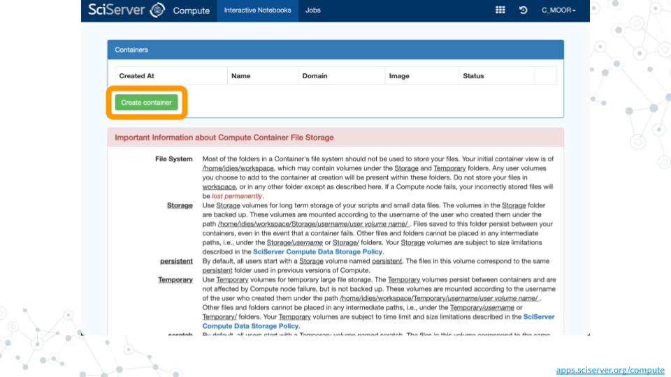
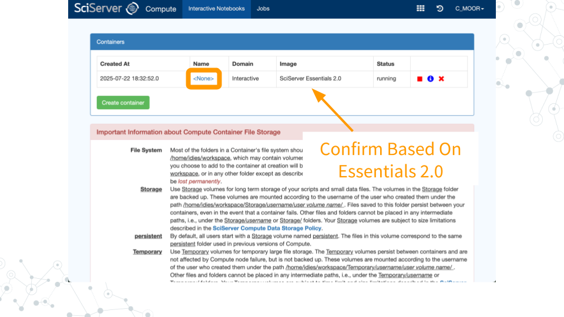
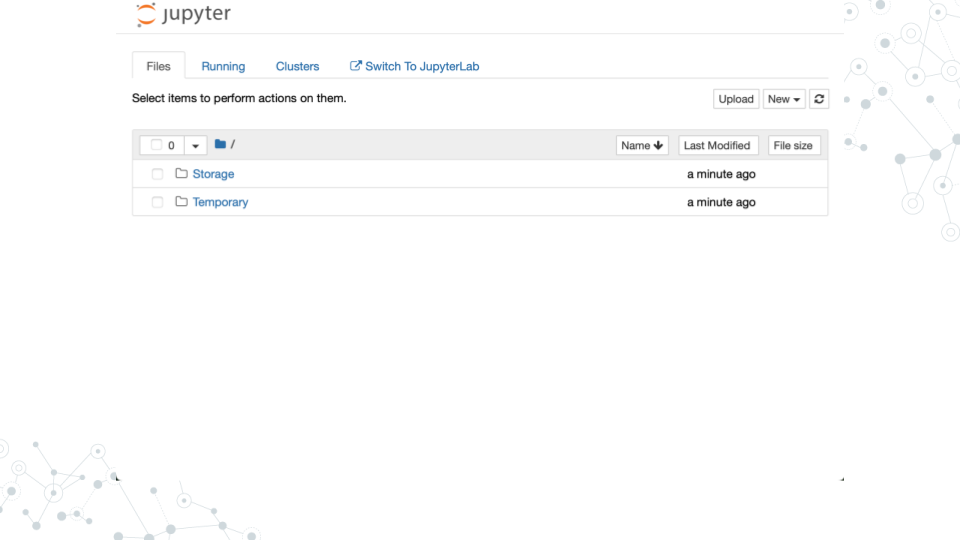
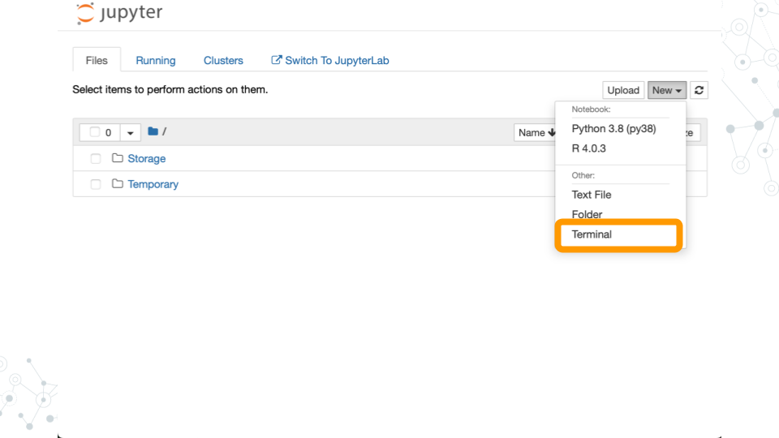
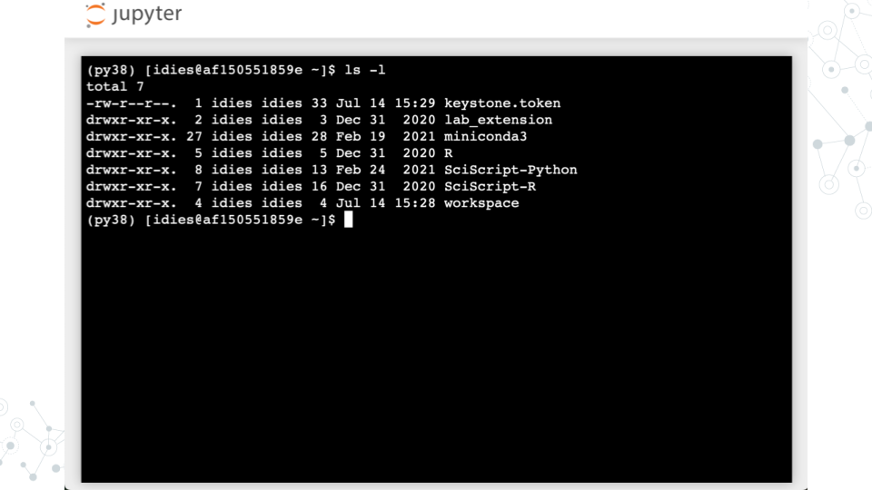
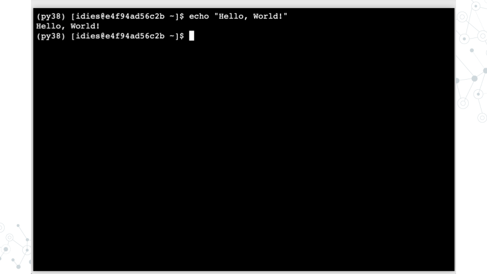
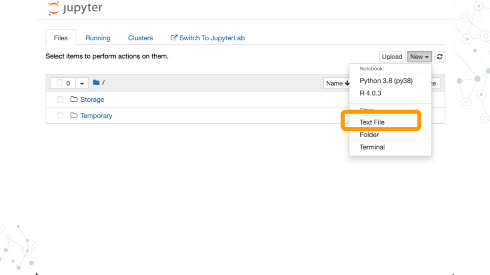
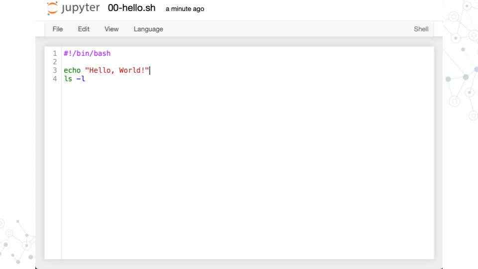
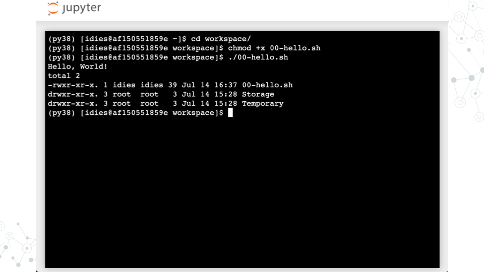

# Set Up Compute

SciServer is an online platform for doing scientific data analysis.  It is used by scientists studying astronomy, biology, oceanography, and more, and is free as long as you are using it for scientific research.  
Using SciServer means you do not need a fancy computer or need to install any special programs on your computer, you can just log in with your internet browser to start doing research.

We will use the Jupyter development environment provided in the `SciServer Essentials 2.0` image.  This web-based environment provides all the tools we need for this course: a text editor and a UNIX environment to run Python scripts.

## Join SciServer

The first step is to create an account on SciServer.  To do this, open https://sciserver.org in a web browser and click “Login to SciServer”.  After clicking on “Create a new account”, fill out the form with a username, email, and password.  Note that you cannot change your username later.


Check your email and click on the verification link.  This will log you into SciServer.


Confirm that your username appears in the upper right hand corner.


## Start Jupyter

To create a container running Jupyter, click “Compute” in the SciServer Dashboard (https://apps.sciserver.org/dashboard).  Click on “Create container” to see what possible compute configurations are available and select `SciServer Essentials 2.0`.



After clicking “Create”, you should now see a new entry in your list of containers.  Confirm that it is using the `SciServer Essentials 2.0` image.  Finally, click on the name of your container and a new tab will open.



Voila!  You should now see the Jupyter interface.




# Running Programs

:::{.notice}

Following is based on the “SciServer Essentials 2.0” image described in Ch 2. Setup Compute

:::

## Learning objectives

- Run a UNIX command

- Wrap a command in a Bash script

- Make a Bash script executable


## Run a UNIX command

- Start a terminal



- Run the `ls -l` command to list files (the `-l` is a command line argument that instructs the `ls` program to modify its operation so that longer details are provided about each file)



- Run `echo "Hello, World!"` to print text to the terminal



## Wrap commands in a Bash script

- Create Text File



- Write your first Bash script




- Run `00-hello.sh`




## Summary

Congratulations! You have just:

- Created a Bash script that prints "Hello, World!" to the terminal


# Hello, World!

## Learning objectives

- Understand how to run Python scripts from the command line

## Python "Hello, World!" example

- Follow the steps from the ***SciServer*** lesson
    
    - Login to SciServer and start a new jupyter notebook

    - Start a new terminal session
    

- Create a new file named `01-helloworld.py` using the text editor and write the following code:

    ```python
    #!/usr/bin/env python3
    print("Hello, World!")
    ```

    - The beginning of the first line, `#!`,  it is called a "hashbang" or "shebang". That indicates which interpreted should process (Python in this case) the file.

    - We use `/usr/bin/env` to find the Python interpreter in the user's environment, which is more flexible than specifying a path like `/usr/bin/python3`. This way, it works regardless of where Python is installed on the system.

    - `python3` is the interpreter that will run the script. It ensures that the script is executed with Python 3, which is important because Python 2 and Python 3 have different syntax and features.

    - Lastly `print("Hello, World!")` is the actual Python code that prints "Hello, World!" to the terminal.


## Run a Python script    

- Save the file and make it executable:

    ```bash
    chmod +x 01-helloworld.py
    ```

- In the terminal, run the script by typing:

    ```bash
    ./01-helloworld.py
    ```

- You should see the output:

   ```
   Hello, World!
   ```

## Summary

Congratulations! You have just:

- Created a Python script that prints "Hello, World!" to the terminal

- Made the script executable

- Ran the script from the command line


# Command line arguments

## Learning objectives

- Understand how to accept command line arguments in Python scripts

- Learn how to access command line arguments using the `sys` module

- Understand how to handle command line arguments

## Printing All Command Line Arguments

Let's make our Python scripts interactive by accepting input from the command line. Create a new file called `02-arguments.py` and type:

    ```python
    #!/usr/bin/env python3

    import sys

    print(sys.argv)
    ```

- Save the file and make it executable:

    ```bash
    chmod +x 02-arguments.py
    ```

- Now run it directly with some arguments:

    ```bash
    ./02-arguments.py hello world 123
    ```

    You'll see output like `['./02-arguments.py', 'hello', 'world', '123']`

The `sys` module provide access to the system-specific parameter. The variable `sys.argv` contains all command line arguments passed to your script, including the script name itself as the first element.


## Understanding Lists

Lists in Python are ordered collections of items enclosed in square brackets, like `[1, 2, 3]` or `["apple", "banana"]`. Lists can contain different types of data and are accessed by the position (index), starting from 0. For example, `my_list[0]` gets the first item, `my_list[1]` gets the second item, and so in.


## Accessing Specific Arguments

- Lets modify our script to print just the second command line argument:

    ```python
    #!/usr/bin/env python3

    import sys

    print("Script name:", sys.argv[0])
    print("First argument:", sys.argv[1])
    ```

- Run it with: `./02-arguments.py hello`

    This prints:

    ```bash
    Script name: ./02-arguments.py
    First argument: hello
    ```

    Notice how `sys.argv[0]` is always the script name, so the first actual argument is at index 1

    ***Warning***: If you don't provide enough arguments, Python will crash with an "IndexError". We'll learn to handle this with `if` statements later

## Arguments Are Strings

Command line arguments are always strings, even if they look like numbers. 

- Update `02-arguments.py`

    ```python
    #!/usr/bin/env python3

    import sys

    # This won't work as expected
    result = sys.argv[1] + sys.argv[2]
    print("Without conversion:", result)

    # Convert strings to integers first
    num1 = int(sys.argv[1])
    num2 = int(sys.argv[2])
    print("With conversion:", num1 + num2)
    ```

- Run it with: `./02-arguments.py 5 3`

    Output:

    ```bash
    Without conversion: 53
    With conversion: 8
    ```

Without conversion, Python concatenates the strings "5" and "3" into "53". The `int()` function converts string representations of numbers into actual integers that can be used in mathematical operations.

## Summary

Congratulations! You have just:

- Created a Python script that accepts command line arguments

- Accessed specific arguments using `sys.argv`


# Parsing files line by line

## Learning objectives

- Understand how to read files in Python

- Learn how to iterate through lines in a file using a `for` loop

## Create a Test File

- Let's create a simple text file called `sample.txt` using the Jupyter text editor

    The file should contain the following lines:

    ```
    apple
    banana
    cherry
    date

    ```

## File Streams in Python

A file stream is like a pipeline that lets you read data from a file one piece at a time. The most common way to open a file is using the `open()` function.

- Create a new Python script called `03-parse-text-file.py`

    ```python
    #!/usr/bin/env python3

    import sys

    my_file = open( sys.argv[1] )
    print(my_file)

    ```

- Save it and make it executable

    ```bash
    chmod +x 03-parse-text-file.py
    ``` 

- Run the script with the file name as an argument

    ```bash
    ./03-parse-text-file.py sample.txt
    ``` 

    This will print something like

    ```bash
    <_io.TextIOWrapper name='sample1.txt' mode='r' encoding='UTF-8'>
    ```

As you can see, the `print()` function can't print the file content directly. This output just indicates the file `sample1.txt` is opened in read mode (`'r'`) with UTF-8 encoding.

## `for` loops

To read the file and print each line, we can use a `for` loop. 

- Update `03-parse-text-file.py`:

    ```python
    #!/usr/bin/env python3

    import sys

    my_file = open(sys.argv[1])

    # for iterates through files
    for my_line in my_file:
        # objects have methods
        my_line = my_line.rstrip("\n")
        print( my_line )

    my_file.close()
    ```
    - We use `my_file.close()` to close the file after we're done reading it. This is important to free up system resources.

- Save it and run the script again

    ```bash
    ./03-parse-text-file.py sample1.txt
    ```

    This will print each line of the file without extra spaces or newlines

    ```bash
    apple
    banana
    cherry
    date
    ```

## Summary

Congratulations! You have just:

- Created a Python script that reads a file 

- Used a `for` loop to iterate through each line in the file

- Printed each line without extra spaces or newlines


# Replicating the `head` command in Python

## Learning objectives

- How to replicate the `head` bash command in Python

- Understand how to read a file and print the first few lines

- Learn how to use a `for` loop to limit the number of lines printed

## Create a new file

- Let's create a simple text file called `sample2.txt` using the Jupyter text editor

    The file should contain the following lines:

    ```
    apple
    banana
    cherry
    date
    elderberry
    fig
    grape
    peach
    kiwi
    lemon
    ```

## Practice the `head` command

The `head` command in Bash prints the first few lines of a file. By default, it shows the first 10 lines, but you can specify a different number with the `-n` option.

- In the terminal, run the command:

    ```bash
    head sample2.txt
    ```
    
    - This will print all the 10 lines of `sample2.txt`

        ```
        apple
        banana
        cherry
        date
        elderberry
        fig
        grape
        peach
        kiwi
        lemon
        ```
- Now try running it with the `-n` option to print only the first 5 lines

    ```bash
    head -n 5 sample2.txt
    ```
    - You should see the following output

        ```
        apple
        banana
        cherry
        date
        elderberry
        ```

## Replicate the `head` command in Python

Now let's create a Python script that replicates the `head` command.

- Create a new Python script called `04-head.py`

    ```python
    #!/usr/bin/env python3

    import sys

    my_file = open( sys.argv[1] )

    max_lines = 10
    if len(sys.argv) > 2:
        max_lines = int(sys.argv[2])

    # be careful of off-by-1 errors
    i = 0
    for my_line in my_file:
        if i >= max_lines:
            break
        my_line = my_line.rstrip("\n")
        print( my_line )
        i = i + 1

    my_file.close()
    ```

    - The script takes two command line arguments: 
        - the file name `sys.argv[1]`
        
        - The number of lines to print `sys.argv[2]`
        
        `If` the second argument is not provided, it defaults to 10.
        
        - The `If` statement is used to check if the number of lines exceeds the maximum specified.

- Save the file and make it executable

    ```bash
    chmod +x 04-head.py
    ```

- Run the script with the file name and number of lines as arguments

    ```bash
    ./04-head.py sample2.txt 5
    ```

    This will print the first 5 lines of `sample2.txt`

    ```
    apple
    banana
    cherry
    date
    elderberry
    ```

## Summary

Congratulations! You have just:

- Created a Python script that replicates the `head` command

- Used command line arguments to specify the file and number of lines to print

# grep.py

# cut.py
