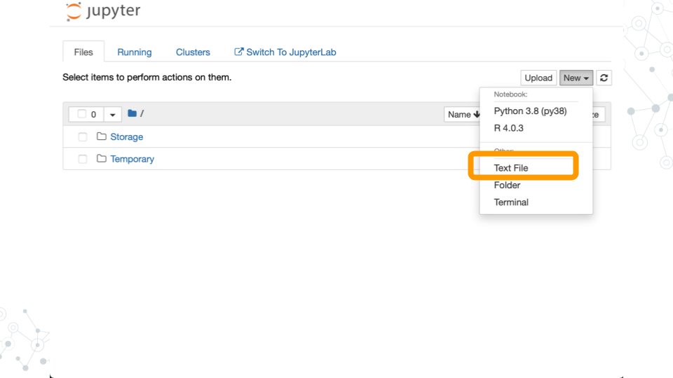
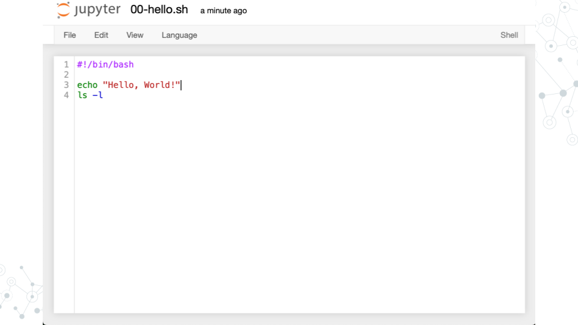

# Exercises

## Unix

:::{.notice}

Following is based on the “SciServer Essentials 2.0” image described in Ch 2. Setup Compute

:::

### Run a command

- Start a terminal


Run the `ls -l` command to list files (the `-l` is a command line argument that instructs the `ls` program to modify its operation so that longer details are provided about each file)


### Wrap a command in a Bash

- Create Text File



- Write your first Bash script




- Run `00-hello.sh`


## Python

### Learning objectives

- Understand how to run Python scripts from the command line

### Hello world example

- Follow the steps from the ***SciServer*** lesson
    
    - Login to SciServer and start a new jupyter notebook

    - Start a new terminal session
    

- Create a new file named `01-helloworld.py` using the text editor and write the following code:

    ```python
    #!/usr/bin/env python3
    print("Hello, world!")
    ```

- Save the file and make it executable:

    ```bash
    chmod +x 01-helloworld.py
    ```

- In the terminal, run the script by typing:

    ```bash
    ./01-helloworld.py
    ```

- You should see the output:

   ```
   Hello, world!
   ```

Congratulations! You have just:

- Created a Python script that prints "Hello, world!" to the terminal

- Made the script executable

- Ran the script from the command line

## Command line arguments

### import sys

### sys.argv

### lists

### types

## Parsing file line by line

### File streams

### for loops

## head.py

## grep.py

## cut.py
