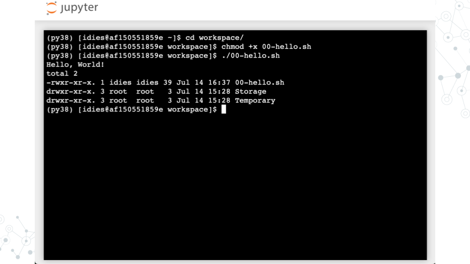

# Running Programs

:::{.notice}

Following is based on the “SciServer Essentials 2.0” image described in Ch 2. Setup Compute

:::

## Learning objectives

- Run a UNIX command

- Wrap a command in a Bash script with `#!`

- Make a Bash script executable


## Run a command

- Start a terminal


Run the `ls -l` command to list files (the `-l` is a command line argument that instructs the `ls` program to modify its operation so that longer details are provided about each file)


## Wrap a command in a Bash

- Create Text File


- Write your first Bash script


- Run `00-hello.sh`




# Hello, World!

## Learning objectives

- Understand how to run Python scripts from the command line

## Hello world example

- Follow the steps from the ***SciServer*** lesson
    
    - Login to SciServer and start a new jupyter notebook

    - Start a new terminal session
    

- Create a new file named `01-helloworld.py` using the text editor and write the following code:

    ```python
    #!/usr/bin/env python3
    print("Hello, world!")
    ```

- Save the file and make it executable:

    ```bash
    chmod +x 01-helloworld.py
    ```

- In the terminal, run the script by typing:

    ```bash
    ./01-helloworld.py
    ```

- You should see the output:

   ```
   Hello, world!
   ```

Congratulations! You have just:

- Created a Python script that prints "Hello, world!" to the terminal

- Made the script executable

- Ran the script from the command line

# Command line arguments

## Printing All Command Line Arguments

Let's make our Python scripts interactive by accepting input from the command line. Create a new file called `02-arguments.py` and type:

```python
#!/usr/bin/env python3

import sys

print(sys.argv)
```

Save the file and make it executable:

```bash
chmod +x 02-arguments.py
```

Now run it directly with some arguments:

```bash
./02-arguments.py hello world 123
```

You'll see output like `['./02-arguments.py', 'hello', 'world', '123']`

The `sys` module provide access to the system-specific parameter. The variable `sys.argv` contains all command line arguments passed to your script, including the script name itself as the first element.


## Understanding Lists

Lists in Python are ordered collections of items enclosed in square brackets, like `[1, 2, 3]` or `["apple", "banana"]`. Lists can contain different types of data and are accessed by the position (index), starting from 0. For example, `my_list[0]` gets the first item, `my_list[1]` gets the second item, and so in.


## Accessing Specific Arguments

Lets modify our script to print just the second command line argument:

```python
#!/usr/bin/env python3

import sys

print("Script name:", sys.argv[0])
print("First argument:", sys.argv[1])
```

Run it with: `./02-arguments.py hello`

This prints:

```bash
Script name: ./02-arguments.py
First argument: hello
```

Notice how `sys.argv[0]` is always the script name, so the first actual argument is at index 1.

***Warning***: If you don't provide enough arguments, Python will crash with an "IndexError". We'll learn to handle this with `if` statements later.

## Arguments Are Strings

Command line arguments are always strings, even if they look like numbers. Update `02-arguments.py`:

```python
#!/usr/bin/env python3

import sys

# This won't work as expected
result = sys.argv[1] + sys.argv[2]
print("Without conversion:", result)

# Convert strings to integers first
num1 = int(sys.argv[1])
num2 = int(sys.argv[2])
print("With conversion:", num1 + num2)
```

Run it with: `./02-arguments.py 5 3`

Output:

```bash
Without conversion: 53
With conversion: 8
```

Without conversion, Python concatenates the strings "5" and "3" into "53". The `int()` function converts string representations of numbers into actual integers that can be used in mathematical operations.


# Parsing file line by line

## File streams

## for loops

# head.py

# grep.py

# cut.py
